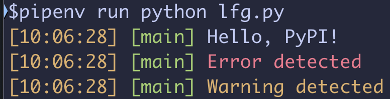

# rslog

An opinionated library for logging locally. It will log a timestamp, the function name and colourize based on keywords in the log string that may indicate an error or warning.



## Installation

```bash
pip install rslog
```

## Usage

```python
from rslog import rslog

rslog("Hello, PyPI!")
```

